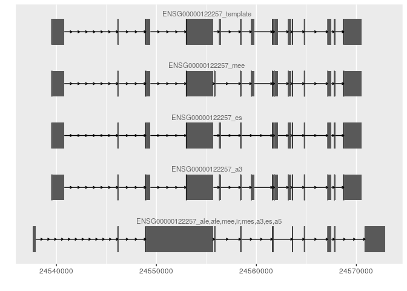

# ASimulatoR

The goal of ASimulatoR is to simulate RNA-seq reads with alternative
splicing events. The alternative splicing events are well documented and
the true origin of each read is used for exon and juntion coverage via a
modified version of the bioconductor polyester package.

Please note that we use a custom version of Polyester, that is available
at <https://github.com/biomedbigdata/polyester>.

## Installation

You can install the current version using the
[remotes](https://cran.r-project.org/web/packages/remotes/index.html)
package:

``` r
# install.packages("remotes")
remotes::install_github("biomedbigdata/ASimulatoR")

# for a specific release e.g. v1.0.0 use
remotes::install_github("biomedbigdata/ASimulatoR@v1.0.0")
```

If you want the latest development version, just install from the dev
branch:

``` r
remotes::install_github("biomedbigdata/ASimulatoR", ref = "dev")
```

This will automatically install all imported R packages.

There may be system requirements that you have to install manually
e.g. on Ubuntu/Debian:

``` bash
apt-get install -y libxml2-dev libcurl4-openssl-dev
```

If you still encounter problems with package versions you can use the
[renv](https://rstudio.github.io/renv/articles/packages.html) package
and simply `restore` our [lockfile](renv.lock).

## Usage

The input directory should contain a gtf/gff3 genome annotation file and
one fasta file per chromosome (e.g. derived from the [Ensembl ftp
server](https://www.ensembl.org/info/data/ftp/index.html)).

ASimulatoR accepts any gtf/gff3 genome annotation and chromosome fasta
files independent of the organism.

### Quick start

This repository contains a documented example Rscript
[runASimulatoR.R](runASimulatoR.R). After installation, scripts like
this can be run from the command-line with the command:

`Rscript runASimulatoR.R /path/to/input_folder/
/path/to/output_folder/`.

### Step by step

For usage in an interactive R-session and to investigate the full
functionality of this package check the following example. The example
is limited to the chromosome 21 for the runtime purpose. For even more
flexibility refer to the section [“The main function:
`simulate_alternative_splicing`”](##%20The%20main%20function:%20%60simulate_alternative_splicing%60):

#### Creating exon supersets

Firstly, we create exon supersets by joining all exons of a gene from a
gtf/gff3 file. These supersets are then used to create splice variants.

Note: Since all exons from one gene are used to create the exon
superset, you may find that the term exon superset is used analogously
to gene.

``` r
suppressMessages(library(ASimulatoR))

# create exon superset for genes on chromosome 21 of ensembl release 99
gtf_file = system.file('extdata', 'Homo_sapiens.GRCh38.99.21.gtf', package = 'ASimulatoR')

# by default the produced superset will be saved as .rda file into the same directory
exon_superset = get_exon_supersets(gtf_file)
#> importing gtf/gff...
#> finished importing gtf/gff
#> 
#> creating superset...
#> finished creating superset
#> 
#> saving superset...
#> finished saving superset
#> 
exon_superset[[1]][1:5, ]
#> GRanges object with 5 ranges and 10 metadata columns:
#>       seqnames            ranges strand |      source        type       score       phase         gene_id            transcript_id  template gene_exon_number  tr_start    tr_end
#>          <Rle>         <IRanges>  <Rle> | <character> <character> <character> <character>     <character>              <character> <logical>        <integer> <integer> <integer>
#>   [1]       21 41879270-41879482      - |  ASimulatoR        exon           .           . ENSG00000141956 ENSG00000141956_template      TRUE                1         1       213
#>   [2]       21 41878996-41879140      - |  ASimulatoR        exon           .           . ENSG00000141956 ENSG00000141956_template      TRUE                2       214       358
#>   [3]       21 41878695-41878860      - |  ASimulatoR        exon           .           . ENSG00000141956 ENSG00000141956_template      TRUE                3       359       524
#>   [4]       21 41871494-41871621      - |  ASimulatoR        exon           .           . ENSG00000141956 ENSG00000141956_template      TRUE                4       525       652
#>   [5]       21 41867300-41867377      - |  ASimulatoR        exon           .           . ENSG00000141956 ENSG00000141956_template      TRUE                5       653       730
#>   -------
#>   seqinfo: 1 sequence from an unspecified genome; no seqlengths
```

#### Simulating Alternative Splicing

You can find more information about the main function of this package at
the [end of the
page](\(##%20The%20main%20function:%20%60simulate_alternative_splicing%60\)).

The simulator supports eight different AS events:

| es           | mes                    | ir               | a3                                  | a5                               | mee                      | afe                    | ale                   |
| ------------ | ---------------------- | ---------------- | ----------------------------------- | -------------------------------- | ------------------------ | ---------------------- | --------------------- |
| exon skiping | multiple exon skipping | intron retention | alternative 3’/acceptor splice site | alternative 5’/donor splice site | mutually exclusive exons | alternative first exon | alternative last exon |

``` r
# define your input_dir, where the annotation gtf (or the exon supersets if you have already created them) and the genome fasta files (one per chromosome) are located
# here we will use the example data
input_dir = system.file('extdata', package = 'ASimulatoR')

# define, how many groups and samples per group you analyze. Here we create a small experiment with two groups with one sample per group:
num_reps = c(1,1)

# define your outdir with NO slash
outdir = 'simulation'

# define the number of genes you want to work with. If you want all exons, do not specify this parameter or set it to NULL
# here we create splice variants from 9 exon supersets:
max_genes = 9
```

The user could define the distribution of the events by probability or
relative frequency.

  - Probability: For each superset we create an event with the
    probability mentioned in `event_prob`.
  - Frequency: Set `probs_as_freq = T`. The exon supersets are
    partitioned corresponding to the `event_prob` parameter.

<!-- end list -->

``` r
# in this example we use relative frequencies
# here we produce eight variants with one of each AS events as well as one variant containing every event
# if probs_as_freq was FALSE, a random number would be drawn for each event-superset combination and only if it was smaller than 1/9 the AS event would be created
probs_as_freq = T
event_freq = 
    setNames(rep(1/9, 9),
             c('es', 'mes', 'ir', 'a3', 'a5', 'afe', 'ale', 'mee', 'es,ir,mes,a3,a5,afe,ale,mee'))


# we use the previously created superset to simulate splice variants from, since it is saved in the same directory as the gtf
# if no superset is found, a new one will be created
simulate_alternative_splicing(input_dir = input_dir,
                              outdir = outdir, 
                              event_probs = event_freq,
                              probs_as_freq = probs_as_freq, 
                              max_genes = max_genes,
                              num_reps = num_reps,
                              verbose = TRUE)
#> found the following fasta files: 21.fa
#> note that splice variants will only be constructed from chromosomes that have a corresponding fasta file
#> 
#> set data.table threads to 1
#> loading superset...
#> finished loading superset
#> 
#> assign variants to supersets...
#> create splicing variants and annotation. This may take a while...
#> finished creating splicing variants and annotation
#> 
#> exporting gtf for read simulation...
#> finished exporting gtf
#> 
#> exporting event_annotation...
#> finished exporting event_annotation...
#> 
#> start simulation with polyester:
#> parsing gtf and sequences...
#> done parsing
#> start sequencing... (1m reads per iteration)
#> sample_01: overall 91608 reads
#> sample_01: iteration 01
#> sample_01: fragments generated
#> sample_01: write read pairs
#> sample_02: overall 78660 reads
#> sample_02: iteration 01
#> sample_02: fragments generated
#> sample_02: write read pairs
#> finished sequencing
```

The user can also use predefined parameters for common scenarios. More
information is in `?presets`:

``` r
outdir_preset = 'simulation_preset'

# We will use the preset 'experiment_bias' which includes typical rna-seq biases such as positional bias arising in protocols that use cDNA fragmentation
# we can still use other arguments such as max_genes to set additional/override existing parameters
simulate_alternative_splicing(input_dir = input_dir,
                              outdir = outdir_preset,
                              preset = 'experiment_bias',
                              max_genes = max_genes,
                              verbose = FALSE)
#> found the following fasta files: 21.fa
#> note that splice variants will only be constructed from chromosomes that have a corresponding fasta file
#> 
#> set data.table threads to 1
#> loading superset...
#> finished loading superset
#> 
#> assign variants to supersets...
#> create splicing variants and annotation. This may take a while...
#> finished creating splicing variants and annotation
#> 
#> exporting gtf for read simulation...
#> finished exporting gtf
#> 
#> exporting event_annotation...
#> finished exporting event_annotation...
#> 
#> start simulation with polyester:
#> parsing gtf and sequences...
#> done parsing
```

#### Visualize Splice Variants

``` r
# to visualize the splice variants we will use ggbio
suppressMessages(library(ggbio))

# firstly, we load the newly created gtf file 
gtf = rtracklayer::import('simulation/splicing_variants.gtf')

# the gene id of the variant with all events
gene_id = gtf$gene_id[grep('es,ir,mes,a3,a5,afe,ale,mee', gtf$transcript_id, fixed = T)[1]]
exons = gtf[gtf$type == 'exon' & gtf$gene_id == gene_id]
suppressWarnings(ggbio::autoplot(split(exons, exons$transcript_id)))
#> Constructing graphics...
```



``` r

# have a look at the event annotation
event_anno = read.csv('simulation/event_annotation.tsv', sep = '\t')
event_anno[grepl(gene_id, event_anno$template) | grepl(gene_id, event_anno$variant), ]
#>    event_annotation                                     variant                                    template                                                                    genomic_start                                                                      genomic_end                         transcriptomic_start                           transcriptomic_end
#> 1               afe ENSG00000154646_es,ir,mes,a3,a5,afe,ale,mee                    ENSG00000154646_template                                                                         18460572                                                                         18460731                                            1                                          160
#> 2               afe                    ENSG00000154646_template ENSG00000154646_es,ir,mes,a3,a5,afe,ale,mee                                                                         18485799                                                                         18485879                                            1                                           81
#> 3               ale ENSG00000154646_es,ir,mes,a3,a5,afe,ale,mee                    ENSG00000154646_template                                                                         18269116                                                                         18270124                                         6950                                         7958
#> 4               ale                    ENSG00000154646_template ENSG00000154646_es,ir,mes,a3,a5,afe,ale,mee                                                                         18275197                                                                         18275336                                         3018                                         3157
#> 5               mee ENSG00000154646_es,ir,mes,a3,a5,afe,ale,mee                    ENSG00000154646_template                                                                         18379283                                                                         18379318                                          792                                          827
#> 6               mee                    ENSG00000154646_template ENSG00000154646_es,ir,mes,a3,a5,afe,ale,mee                                                                         18372193                                                                         18372324                                          786                                          917
#> 7               mes ENSG00000154646_es,ir,mes,a3,a5,afe,ale,mee                    ENSG00000154646_template 18332084,18329169,18326432,18315146,18312945,18297734,18294603,18294270,18281040 18332173,18329294,18326572,18315256,18313077,18297829,18294652,18294444,18281221 1818,1908,2034,2175,2286,2419,2515,2565,2740 1907,2033,2174,2285,2418,2514,2564,2739,2921
#> 8                es ENSG00000154646_es,ir,mes,a3,a5,afe,ale,mee                    ENSG00000154646_template                                                                         18352903                                                                         18353052                                         1275                                         1424
#> 9                ir ENSG00000154646_es,ir,mes,a3,a5,afe,ale,mee                    ENSG00000154646_template                                                                         18359864                                                                         18365139                                         1223                                         6498
#> 10               a3 ENSG00000154646_es,ir,mes,a3,a5,afe,ale,mee                    ENSG00000154646_template                                                                         18383728                                                                         18383778                                          589                                          639
#> 11               a5 ENSG00000154646_es,ir,mes,a3,a5,afe,ale,mee                    ENSG00000154646_template                                                                         18398199                                                                         18398220                                          499                                          520
```

## The main function: `simulate_alternative_splicing`

### Description

Here we describe in more detail the parameters that can be passed to
this function for a better control over the simulation.

### Usage

``` r
simulate_alternative_splicing(input_dir, outdir, event_probs, ncores = 1L, ...)
```

### Arguments

| Argument      | Description                                                                                                                                                                                                                                                                                                                                                  |
| ------------- | ------------------------------------------------------------------------------------------------------------------------------------------------------------------------------------------------------------------------------------------------------------------------------------------------------------------------------------------------------------ |
| `input_dir`   | Character path to directory containing the gtf/gff file from which splice variants are created and genome fasta files with one file per chromosome i.e. <chr_name>.fa passed to polyester                                                                                                                                                                    |
| `outdir`      | character, path to folder where simulated reads and all annotations should be written, with *no* slash at the end. By default, reads are written to current working directory.                                                                                                                                                                               |
| `event_probs` | Named list/vector containing numerics corresponding to the probabilites to create the event (combination). If `probs_as_freq` is `TRUE` `event_probs` correspond to the relative frequency of occurences for the event(combination) and in this case the sum of all frequencies has to be \<=1. No default, must not be `NULL`, except if `preset` is given. |
| `preset`      | if you want to use preset parameters one of ‘event\_partition’, ‘experiment\_bias’, ‘event\_combination\_2’. Check `?presets` for more information                                                                                                                                                                                                           |
| `ncores`      | the number of cores to be utilized for parallel generation of splice variant creation and read simulation.                                                                                                                                                                                                                                                   |
| `...`         | any of several other arguments that can be used to add nuance to the simulation and splice variant creation. See section Details.                                                                                                                                                                                                                            |

### Details

Several optional parameters can be defined to adjust the simulation.
These parameters are further used by the `simulate_experiment` function
from our [custom polyester R
package](https://github.com/biomedbigdata/polyester).

The following parameters are specific for the ASimulatoR package:

  - `novel_variants` : Numeric value between 0 and 1 indicating the
    percentage of splicing variants that will be suppressed in an
    additional gtf file splicing\_variants\_novel.gtf.

  - `write_gff` : Additionally to the gtf file containing the splice
    variants, a gff3 file with the same content will be printed to the
    outdir. Default `TRUE`

  - `max_genes` : The maximum number of genes/exon supersets to be
    included in the process of splice variant creation. Default `NULL`
    which means that all available exon supersets will be used. **This
    is a computation heavy default and you might want to adjust it\!**

  - `exon_junction_coverage` : Should the real coverage of exons,
    junctions and retained introns be written into a additional file.
    Default `TRUE`

  - `multi_events_per_exon` : Should it be possible to have more than
    one AS event at the same exon if multiple variants are created for
    the same exon superset? \!If this option is set to `TRUE` , there
    may occur unforeseen AS events that are not documented in the
    event\_annotation file\!. Default `FALSE`

  - `probs_as_freq` : Should `event_probs` be treated as relative
    frequencies instead of probabilities? Default `FALSE`

  - `save_exon_superset` : Should the exon supersets be saved to .rda
    file? Default `TRUE`

These parameters are used by the polyester function
`simulate_experiment` and have different defaults assigned in
ASimulatoR:

  - `fold_changes` : Currently, ASimulatoR introduces random isoform
    switches. Those can be retraced in the sim\_tx\_info.txt file
    written by polyester. We plan on improving this in the future.

  - `strand_specific` : Strand-specific simulation (1st read forward
    strand, 2nd read reverse strand with respect to transcript
    sequence). Default `TRUE` .

  - `meanmodel` : `reads_per_transcripts` as a function of transcript
    length. Always `TRUE` in ASimulatoR.

  - `frag_GC_bias`: A sample-specific GC content bias on the fragment
    level. Currently not supported in ASimulatoR: always ‘none’.

  - `verbose` : Should progress messages be printed during the
    sequencing process? Default `TRUE` .

  - `exon_junction_coverage` : Should the coverage of exons, junctions
    and retained introns be determined? Default `TRUE` .

  - `exon_junction_table` : If `exon_junction_coverage=TRUE` a
    `data.table` produced by `create_splicing_variants_and_annotation`
    to determine exon and intron coverage.

These parameters are used by the `simulate_experiment` from the
polyester R package to introduce technical biases.

  - `pcr_rate`: Fraction of fragments that will be duplicated. Reads
    from these fragments will have PCR\_DUP in the name.
  - `pcr_lambda`: If `!is.null(pcr_rate)` lambda for the poisson
    distribution to draw the number of duplicates.
  - `adapter_contamination`: If the fragment is smaller than the
    readlength, should we sequence into the `adapter_sequence`?
  - `adapter_sequence`: If `adapter_contamination`: adapter sequence
  - `bias`: Positional bias model to use when fragmenting transcripts.
    By default, all fragments from a transcript are equally likely
    (`'none'`). Other choices are `'rnaf'` and `'cdnaf'`, which mimic
    positional bias arising from different fragmentation protocols. See
    `?generate_fragments` and the polyester manuscript (Frazee et al,
    2014) for details.

Note: The user can further adjust the RNA-Seq reads simulation. Try
`?simulate_experiment` to check all available parameters.

## Manuscript Use Case:

If you would like to reproduce the use case mentioned in the manuscript
you can use the corresponding preset:

``` r
# this preset uses a sequencing depth of 200 million reads
simulate_alternative_splicing('some_input_dir', 'some_output_dir', preset = 'manuscript')

# if you want to adjust the sequencing depth you can easily override it to create a lower coverage
simulate_alternative_splicing('some_input_dir', 'some_output_dir', preset = 'manuscript', seq_depth = 5e07)
```

## Value

No return, but simulated reads, a simulation info file, an alternative
splicing event annotation and exon and junction coverages are written to
`outdir` .

## References

Alyssa C. Frazee, Andrew E. Jaffe, Ben Langmead, Jeffrey T. Leek,
Polyester: simulating RNA-seq datasets with differential transcript
expression, Bioinformatics, Volume 31, Issue 17, 1 September 2015, Pages
2778–2784, <https://doi.org/10.1093/bioinformatics/btv272>

## License

ASimulatoR Copyright (C) 2020 Manz, Quirin

This program is free software: you can redistribute it and/or modify it
under the terms of the GNU General Public License as published by the
Free Software Foundation, either version 3 of the License, or (at your
option) any later version.

This program is distributed in the hope that it will be useful, but
WITHOUT ANY WARRANTY; without even the implied warranty of
MERCHANTABILITY or FITNESS FOR A PARTICULAR PURPOSE. See the GNU General
Public License for more details.

You should have received a copy of the GNU General Public License along
with this program. If not, see <https://www.gnu.org/licenses/>.
