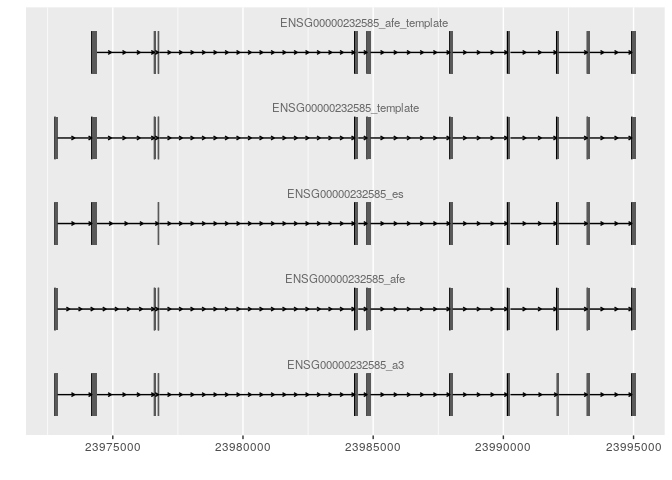

<!-- README.md is generated from README.Rmd. Please edit that file -->

# ass

<!-- badges: start -->

<!-- badges: end -->

The goal of ass is to
…

## Installation

<!-- You can install the released version of ass from [CRAN](https://CRAN.R-project.org) with: -->

<!-- ``` r -->

<!-- install.packages("ass") -->

<!-- ``` -->

You can install the development version from
[GitHub](https://github.com/) with:

``` r
# install.packages("devtools")
devtools::install_github("quirinmanz/polyester",
                         auth_token = "16946cf3c89e74cd07363d0f660559e4339d730b")
devtools::install_github("biomedbigdata/as_simulator",
                         auth_token = "16946cf3c89e74cd07363d0f660559e4339d730b")
```

## Example

This is a basic example which shows you how to solve a common problem:

``` r
library(ass)
#> Loading required package: rtracklayer
#> Loading required package: GenomicRanges
#> Loading required package: stats4
#> Loading required package: BiocGenerics
#> Loading required package: parallel
#> 
#> Attaching package: 'BiocGenerics'
#> The following objects are masked from 'package:parallel':
#> 
#>     clusterApply, clusterApplyLB, clusterCall, clusterEvalQ,
#>     clusterExport, clusterMap, parApply, parCapply, parLapply,
#>     parLapplyLB, parRapply, parSapply, parSapplyLB
#> The following objects are masked from 'package:stats':
#> 
#>     IQR, mad, sd, var, xtabs
#> The following objects are masked from 'package:base':
#> 
#>     anyDuplicated, append, as.data.frame, basename, cbind, colnames,
#>     dirname, do.call, duplicated, eval, evalq, Filter, Find, get, grep,
#>     grepl, intersect, is.unsorted, lapply, Map, mapply, match, mget,
#>     order, paste, pmax, pmax.int, pmin, pmin.int, Position, rank,
#>     rbind, Reduce, rownames, sapply, setdiff, sort, table, tapply,
#>     union, unique, unsplit, which, which.max, which.min
#> Loading required package: S4Vectors
#> 
#> Attaching package: 'S4Vectors'
#> The following object is masked from 'package:base':
#> 
#>     expand.grid
#> Loading required package: IRanges
#> Loading required package: GenomeInfoDb
#> Loading required package: data.table
#> 
#> Attaching package: 'data.table'
#> The following object is masked from 'package:GenomicRanges':
#> 
#>     shift
#> The following object is masked from 'package:IRanges':
#> 
#>     shift
#> The following objects are masked from 'package:S4Vectors':
#> 
#>     first, second
## basic example code
```

What is special about using `README.Rmd` instead of just `README.md`?
You can include R chunks like so:

``` r
#summary(cars)
```

You’ll still need to render `README.Rmd` regularly, to keep `README.md`
up-to-date.

You can also embed plots, for example:

    #> Registered S3 method overwritten by 'GGally':
    #>   method from   
    #>   +.gg   ggplot2
    #> Need specific help about ggbio? try mailing 
    #>  the maintainer or visit http://tengfei.github.com/ggbio/
    #> 
    #> Attaching package: 'ggbio'
    #> The following objects are masked from 'package:ggplot2':
    #> 
    #>     geom_bar, geom_rect, geom_segment, ggsave, stat_bin, stat_identity,
    #>     xlim
    #> Welcome to Bioconductor
    #> 
    #>     Vignettes contain introductory material; view with
    #>     'browseVignettes()'. To cite Bioconductor, see
    #>     'citation("Biobase")', and for packages 'citation("pkgname")'.
    #> Constructing graphics...
    #> Warning: `quo_expr()` is deprecated as of rlang 0.2.0.
    #> Please use `quo_squash()` instead.
    #> This warning is displayed once per session.



In that case, don’t forget to commit and push the resulting figure
files, so they display on GitHub\!
